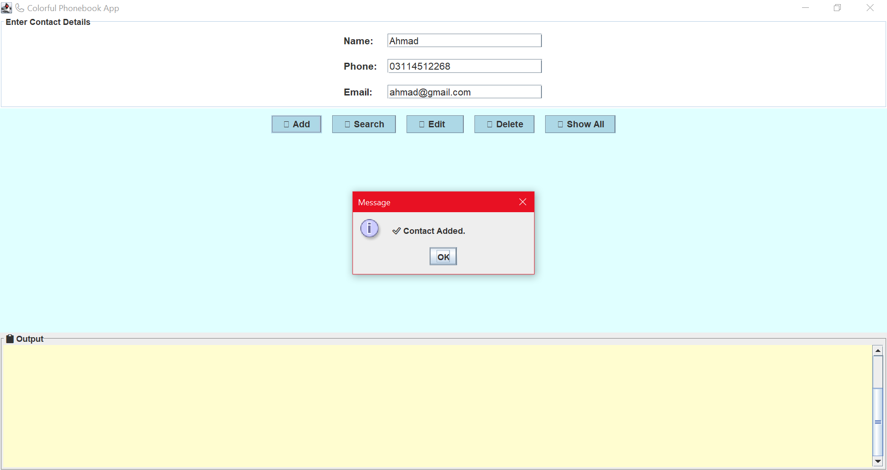
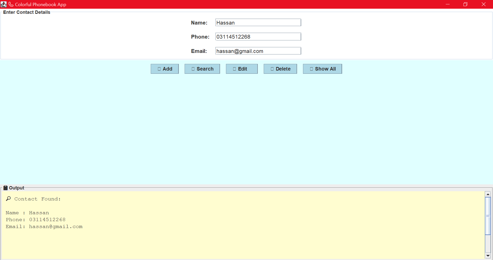
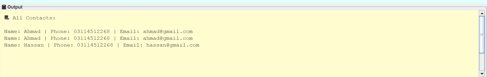

# Java GUI Phonebook 📞

A simple **Java Swing-based GUI application** for managing phonebook contacts. This project allows users to **add, search, edit, delete, and display contacts**, with input validation and data persistence using a local file.

---

## 🧑‍💻 Group Members

| Name                | Registration Number   | Contribution                          |
|---------------------|------------------------|----------------------------------------|
| **Ahmad Hassan**     | L1F22BSSE0061          | Team Lead – GUI Design, Integration, Git, Testing |
| **Maira Ikram Malik**| L1F22BSSE0074          | Input Validation (Phone & Email), User Input Handling |
| **Yashel Noor Malik**| L1F22BSSE0072          | Data Persistence (File Save/Load), Code Review |

---

## 📌 Project Features

- ✅ Add a new contact (Name, Phone, Email)
- 🔍 Search a contact by name
- ✏️ Edit existing contact information
- ❌ Delete a contact
- 📋 Display all saved contacts
- ✔️ Input Validation (Phone: 11 digits, valid Email format)
- 💾 Save contacts to a local text file (`contacts.txt`)
- ♻️ Replayable GUI experience – add/edit/delete without restarting

---

## 🛠️ Tech Stack

- **Language**: Java
- **GUI**: Swing (JFrame, JPanel, JTextField, JButton)
- **IDE**: Eclipse IDE
- **Version Control**: GitHub (Feature Branch Workflow)

---

## 📁 File Structure

📦 Java-GUI-Phonebook
┣ 📄 Main.java # GUI code
┣ 📄 Contact.java # Contact model (name, phone, email)
┣ 📄 PhonebookManager.java # Logic for saving, editing, searching
┣ 📄 contacts.txt # File where contacts are saved
┣ 📄 README.md # Project documentation
┗ 📄 .gitignore # Java-specific ignore rules

---

## 🔁 Git Workflow (Feature Branch Strategy)

- `feature/gui` → GUI layout and design (Ahmad)
- `feature/validation` → Input validation logic (Maira)
- `feature/persistence` → File save/load methods (Yashel)
- All merged into `main` with proper commit messages

---

## 💡 How to Run

1. Open the project in **Eclipse IDE**
2. Run `Main.java`
3. Use the GUI to add/search/edit/delete contacts
4. All contacts are saved automatically in `contacts.txt`

---

## 📷 Screenshots

### ➕ Add Contact Interface

### 🔍 Search Contact Result

### 🎨 Colorful Output Display

---

## 📚 Learnings

- Java Swing UI Development
- Git version control and collaboration
- File handling and data persistence
- Input validation using regex
- Working in a team environment with division of responsibilities

---

## ✅ Project Status

✅ **Completed** – Ready for final viva & demonstration  
📅 **Deadline Met** – Submission before lab final week

---

## 🔗 Project Maintained By

Made by Ahmad, Maira, and Yashel – BSSE 6th Semester  
UCP - University of Central Punjab, Lahore

